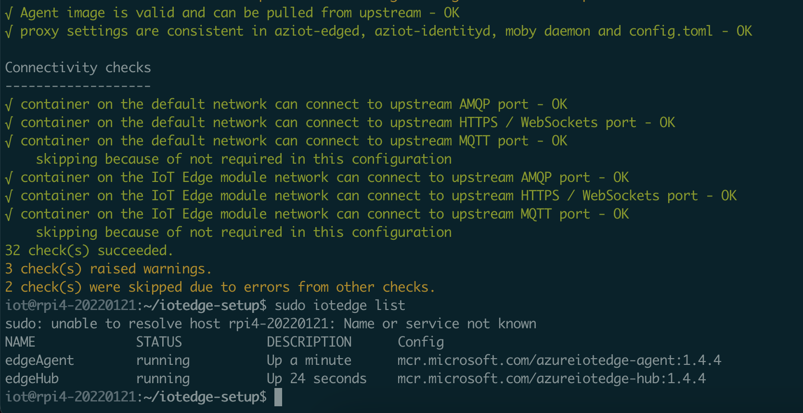
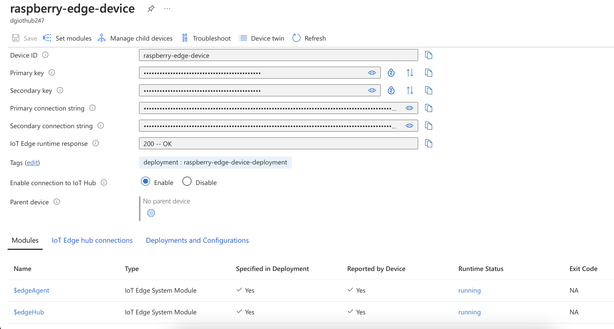

# raspberry-py-iot config

IoT Edge Runtime Installer (shell scripts) for Raspberry Pi ARM64 systems running Debian 11 Bullseye.

## Table of Contents
- [Pre-Requisites](#pre-requisites)
- [Create Edge Device](#create-edge-device)
- [Generate Installation Package](#generate-installation-package)
- [Installation of Package](#installation-of-package)

## Pre-Requisites

1. You have a [Raspberry Pi 4](https://www.raspberrypi.com/products/raspberry-pi-4-model-b/) with a wired keyboard, monitor, usb-c power source, micro HDMI cable, and stable internet connection (ethernet or wireless).

2. The [Debian 11 Bullseye ARM64 image](https://www.debian.org/releases/bullseye/) has been downloaded and flashed onto the microSD card (using a software such as [Balena Etcher](https://www.balena.io/etcher/)) that will be inserted into the Raspberry Pi.

3. The Pi has been powered on and you have established a network connection through ethernet or through the `/etc/network/interfaces.d/wlan0` file.

    ```sh
    # open the network configuration file
    nano /etc/network/interfaces.d/wlan0
    ```

    ```sh
    # To enable wireless networking, uncomment the following lines and -naturally-
    # replace with your network's details.

    # allow-hotplug wlan0
    # iface wlan0 inet dhcp
    # iface wlan0 inet6 dhcp
    #     wpa-ssid my-network-ssid
    #     wpa-psk s3kr3t_P4ss
    ```

    ```sh
    # To enable wireless networking, uncomment the following lines and -naturally-
    # replace with your network's details.

     allow-hotplug wlan0
     iface wlan0 inet dhcp
    # iface wlan0 inet6 dhcp
         wpa-ssid my-network-ssid
         wpa-psk s3kr3t_P4ss
    ```

    ```sh
    # reboot for changes to take affect
    reboot

    # update package list
    apt update

    # install updated package list
    apt upgrade

    # install sudo
    apt install sudo -y
    ```

4. The root user password has been updated.

    ```sh
    passwd
    ```

5. A non-root user has been created and granted sudo permissions.

    ```sh
    # create a new user
    adduser yourUsername

    # grant the user sudo access
    usermod -aG sudo iot

    # reboot and login as yourUsername
    reboot
    ```

6. Root logins via password have been enabled.

    ```sh
    # open the ssh config file
    nano /etc/ssh/sshd_config
    ```

    ```sh
    # Authentication:
    
    #LoginGraceTime 2m
    #PermitRootLogin prohibit-password
    #StrictMode yes
    
    ...

    # To disable tunneled clear text passwords, change to no here!
    #PasswordAuthentication yes
    #PermitEmptyPasswords no
    ```

    ```sh
    # Authentication:
    
    #LoginGraceTime 2m
    PermitRootLogin yes
    #StrictMode yes
    
    ...

    # To disable tunneled clear text passwords, change to no here!
    PasswordAuthentication yes
    #PermitEmptyPasswords no
    ```

    ```sh
    # restart the ssh service for changes to take affect
    sudo systemctl restart sshd
    ```

7. You have obtained the private IP address of the Raspberry Pi.

    ```sh
    ip a
    ```

8. You have tested an SSH login as the newly created user from a remote machine.

    ```sh
    ssh yourUsername@your.ip.address
    ```

## Create Edge Device

Before we can start the installation and configuration of our IoT Edge device, the device needs to first exist in our Azure IoT Hub so that the Raspberry Pi running our software has something to authenticate against.

Reference the GitHub Actions Workflow from this repository to create an IoT edge device - using your parameters and credentials.  If you decide to run this through your own GitHub Actions Workflow, you'll need to be sure you create the equivalent `AZURE_SP_CREDENTIALS` secret in GitHub with the service principal credentials to your Azure Portal.

```json
{
    "clientId": "",
    "clientSecret": "",
    "subscriptionId": "",
    "tenantId": ""
}
```

Alternatively, you can simply install the [Azure CLI](https://learn.microsoft.com/en-us/cli/azure/), login and run the commands seen in the `create-edge-device.yml` file.

## Generate Installation Package

The remaining steps should be run from the unix machine that this repository was cloned to.

This step will generate a package that contain installation scripts. These scripts will install the latest version of Azure's IoT Edge Runtime.

Run the script to create, package and gzip the installation scripts.

```sh
# SCRIPT ARGUMENTS:
# 1 - Edge Device ID - ex: my-edge-device-id
# 2 - Edge Device Connection String - ex: HostName********
# 3 - Running on OSX (optional)? - ex: true

bash ./generator.sh \
    "my-edge-device-id" \
    "edgeDeviceCnxStr"
```

## Installation of Package

After generating the installation package in the previous step, it's now time to install the package on the device hardware.

Run the script to copy and unzip the installation package on the Raspberry Pi.

```sh
# run the script to copy and unpack the installation package on the Raspberry Pi
# SCRIPT ARGUMENTS:
# 1 - Edge Device ID - ex: my-edge-device-id
# 2 - Edge Device IP - ex: 10.0.0.185
# 3 - Edge Device User - ex: yourUsername

bash ./installer.sh \
    "my-edge-device-id" \
    "10.0.0.185" \
    "yourUsername"
```

SSH into the Raspberry Pi and execute the installation script.

```sh
ssh yourUsername@your.ip.address

cd iotedge-setup

sudo bash iotedge-install.sh
```

Confirm the installation and status of the edge device.

```sh
# print out the active configuration that was applied by our script
sudo cat /etc/aziot/config.toml

# run an IoT Edge system status check
sudo iotedge system status

# run an IoT Edge configuration check
sudo iotedge check --verbose

# list active IoT Edge modules
sudo iotedge list
```




